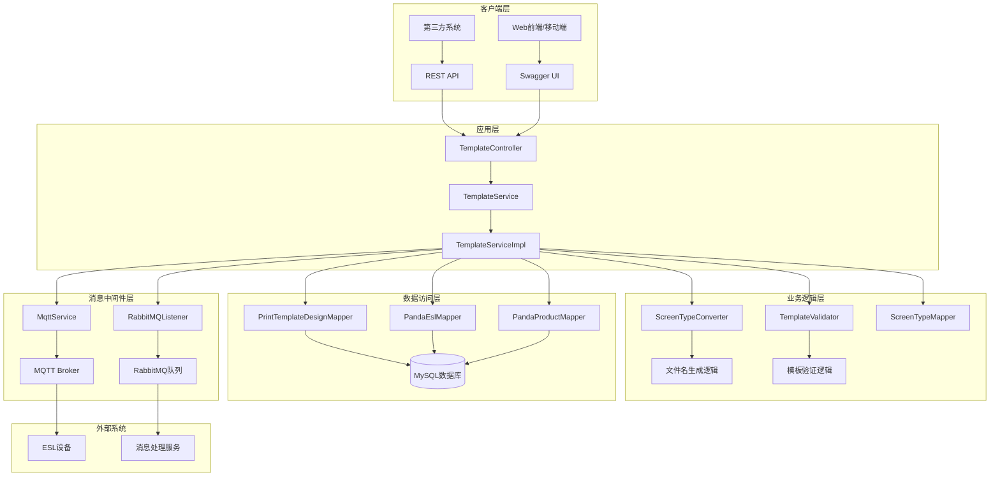
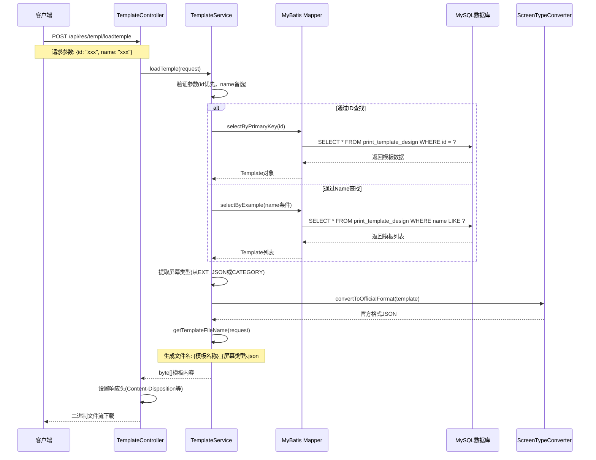
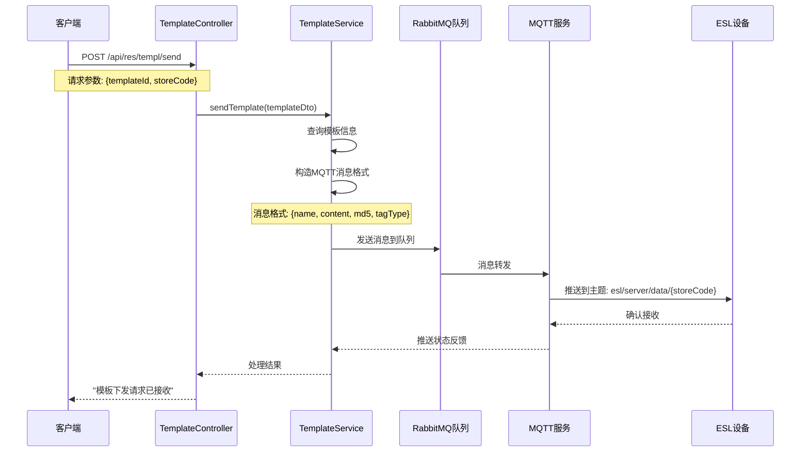

# ESL平台模板下载服务 - 项目框架详细说明

## 📋 项目概述

**项目名称**: downloadcf (ESL Template Download Service)  
**技术栈**: Spring Boot 3.4.5 + MyBatis + MySQL + RabbitMQ + MQTT + Swagger  
**Java版本**: JDK 17  
**项目类型**: 电子价签(ESL)模板管理与下发服务  

这是一个专门为电子价签系统设计的模板管理服务，主要负责模板的存储、下载、格式转换和消息推送功能。

## 🏗️ 系统架构图



## 🔄 业务流程图

### 模板下载流程


### 模板下发流程


## 📁 项目目录结构详解

### 根目录文件
```
e:\IdeaProjects\cfdownloadexample\
├── .gitattributes              # Git属性配置文件
├── .gitignore                  # Git忽略文件配置
├── .mvn\                       # Maven Wrapper配置目录
├── U_06.json                   # 示例模板文件(06屏幕类型)
├── err.md                      # 错误日志记录文件
├── err2.md                     # 项目框架说明文档(本文件)
├── eslplatform结构.sql          # 数据库结构脚本
├── json\                       # 测试用JSON模板文件目录
├── log.md                      # 系统日志记录
├── logs\                       # 运行时日志目录
├── mvnw                        # Maven Wrapper脚本(Unix)
├── mvnw.cmd                    # Maven Wrapper脚本(Windows)
├── pom.xml                     # Maven项目配置文件
└── src\                        # 源代码目录
```

### 源代码结构 (src/main/java)
```
com.pandatech.downloadcf\
├── DownloadcfApplication.java          # Spring Boot启动类
├── config\                             # 配置类目录
│   ├── MqttConfig.java                # MQTT连接配置
│   ├── RabbitMQConfig.java            # RabbitMQ连接配置  
│   ├── SwaggerConfig.java             # Swagger API文档配置
│   └── TemplateConfig.java            # 模板相关配置
├── controller\                         # 控制器层
│   └── TemplateController.java        # 模板操作REST API控制器
├── dto\                               # 数据传输对象
│   ├── LoadTemplateRequest.java       # 模板加载请求DTO
│   ├── RefreshDto.java                # 价签刷新请求DTO
│   └── TemplateDto.java               # 模板下发请求DTO
├── entity\                            # 实体类(数据库映射)
│   ├── EslBrand.java                  # ESL品牌实体
│   ├── EslFieldDefinition.java       # ESL字段定义实体
│   ├── EslModel.java                  # ESL型号实体
│   ├── PandaEsl.java                  # 熊猫ESL设备实体
│   ├── PandaProduct.java              # 熊猫产品实体
│   ├── PrintTemplateDesign.java      # 打印模板设计实体
│   ├── ProductEslBinding.java         # 产品ESL绑定关系实体
│   └── *Example.java                  # MyBatis查询条件构建类
├── exception\                         # 异常处理
│   └── TemplateException.java         # 模板相关异常类
├── mapper\                            # MyBatis数据访问层
│   ├── EslBrandMapper.java            # ESL品牌数据访问
│   ├── EslFieldDefinitionMapper.java # ESL字段定义数据访问
│   ├── EslModelMapper.java            # ESL型号数据访问
│   ├── PandaEslMapper.java            # 熊猫ESL设备数据访问
│   ├── PandaProductMapper.java        # 熊猫产品数据访问
│   ├── PrintTemplateDesignMapper.java # 打印模板设计数据访问
│   └── ProductEslBindingMapper.java   # 产品ESL绑定数据访问
├── service\                           # 业务逻辑层
│   ├── FieldMappingService.java       # 字段映射服务接口
│   ├── MqttService.java               # MQTT消息服务
│   ├── RabbitMQListener.java          # RabbitMQ消息监听器
│   ├── TemplateService.java           # 模板服务接口
│   ├── TemplateServiceImpl.java       # 模板服务实现类
│   └── impl\                          # 服务实现类目录
└── util\                              # 工具类
    ├── ScreenTypeConverter.java       # 屏幕类型转换器
    ├── ScreenTypeMapper.java          # 屏幕类型映射器
    └── TemplateValidator.java         # 模板验证器
```

### 资源文件结构 (src/main/resources)
```
resources\
├── application.yml                     # 应用配置文件
├── mapper\                            # MyBatis XML映射文件
│   ├── EslBrandMapper.xml             # ESL品牌SQL映射
│   ├── EslFieldDefinitionMapper.xml   # ESL字段定义SQL映射
│   ├── EslModelMapper.xml             # ESL型号SQL映射
│   ├── PandaEslMapper.xml             # 熊猫ESL设备SQL映射
│   ├── PandaProductMapper.xml         # 熊猫产品SQL映射
│   ├── PrintTemplateDesignMapper.xml  # 打印模板设计SQL映射
│   └── ProductEslBindingMapper.xml    # 产品ESL绑定SQL映射
└── mybatis-generator-config.xml       # MyBatis代码生成器配置
```

## 🔧 核心组件功能详解

### 1. 控制器层 (Controller)

#### TemplateController.java
**功能**: REST API接口层，提供HTTP服务
**主要接口**:
- `POST /api/res/templ/send` - 模板下发接口
- `POST /api/res/templ/refresh` - 价签刷新接口  
- `POST /api/res/templ/loadtemple` - 模板下载接口

**设计特点**:
- 使用Swagger注解提供API文档
- 统一的异常处理和响应格式
- 支持文件流下载，设置正确的Content-Type和Content-Disposition

### 2. 服务层 (Service)

#### TemplateService.java & TemplateServiceImpl.java
**核心业务逻辑**:
- **模板查找**: 优先通过ID查找，ID为空时使用name进行模糊匹配
- **格式转换**: 将数据库存储格式转换为ESL设备识别的官方格式
- **文件命名**: 生成`{模板名称}_{屏幕类型}.json`格式的下载文件名
- **消息构建**: 构造MQTT消息格式，包含name、content、md5、tagType等字段

**关键方法**:
```java
// 模板加载
byte[] loadTemple(LoadTemplateRequest request)

// 文件名生成  
String getTemplateFileName(LoadTemplateRequest request)

// 模板下发
void sendTemplate(TemplateDto templateDto)

// 价签刷新
void refreshEsl(RefreshDto refreshDto)
```

### 3. 工具类层 (Util)

#### ScreenTypeConverter.java
**功能**: 屏幕类型转换和文件名生成
- 移除现有的`.json`后缀和屏幕类型后缀
- 根据新的屏幕类型生成标准文件名
- 支持多种屏幕类型映射(06, 12, 等)

#### ScreenTypeMapper.java  
**功能**: 屏幕类型映射配置
- 维护屏幕类型代码与描述的映射关系
- 提供屏幕类型验证功能

#### TemplateValidator.java
**功能**: 模板内容验证
- JSON格式验证
- 必要字段检查
- 模板结构完整性验证

### 4. 数据访问层 (Mapper)

#### PrintTemplateDesignMapper.java
**功能**: 模板设计数据访问
- 支持按ID精确查询
- 支持按名称模糊查询
- 提供复杂条件查询(通过Example类)

**关键字段**:
- `ID`: 模板唯一标识
- `NAME`: 模板名称
- `CONTENT`: 模板内容(JSON格式)
- `EXT_JSON`: 扩展信息(包含屏幕类型等)
- `CATEGORY`: 分类信息

### 5. 配置层 (Config)

#### MqttConfig.java
**功能**: MQTT连接配置
- 配置MQTT客户端连接参数
- 设置消息发布和订阅主题
- 配置连接池和重连机制

#### RabbitMQConfig.java  
**功能**: RabbitMQ消息队列配置
- 定义队列、交换机和路由键
- 配置消息序列化方式
- 设置消费者并发数

#### SwaggerConfig.java
**功能**: API文档配置
- 配置Swagger UI界面
- 定义API分组和描述
- 设置认证方式

## 💾 数据库设计

### 核心表结构

#### print_template_design (模板设计表)
```sql
CREATE TABLE `print_template_design` (
  `ID` varchar(20) NOT NULL COMMENT '主键',
  `TENANT_ID` varchar(20) COMMENT '租户ID',
  `NAME` varchar(255) COMMENT '模板名称',
  `CODE` varchar(255) COMMENT '模板编码', 
  `CONTENT` longtext COMMENT '模板内容(JSON)',
  `CATEGORY` varchar(255) COMMENT '分类',
  `EXT_JSON` longtext COMMENT '扩展信息',
  `DELETE_FLAG` varchar(20) COMMENT '删除标识',
  `CREATE_TIME` datetime COMMENT '创建时间',
  `CREATE_USER` varchar(20) COMMENT '创建用户',
  `UPDATE_TIME` datetime COMMENT '修改时间',
  `UPDATE_USER` varchar(20) COMMENT '修改用户',
  PRIMARY KEY (`ID`)
);
```

#### panda_esl (ESL设备表)
```sql
CREATE TABLE `panda_esl` (
  `ID` varchar(20) NOT NULL COMMENT '主键',
  `ESL_ID` varchar(50) COMMENT 'ESL设备ID',
  `STORE_CODE` varchar(50) COMMENT '门店编码',
  `ESL_MODEL` varchar(50) COMMENT 'ESL型号',
  `BOUND_PRODUCT` varchar(50) COMMENT '绑定产品',
  `BATTERY_LEVEL` float COMMENT '电池电量',
  `SIGNAL_STRENGTH` int COMMENT '信号强度',
  `ESL_STATUS` varchar(20) COMMENT 'ESL状态',
  `SCREEN_COLOR` varchar(20) COMMENT '屏幕颜色',
  -- 其他字段...
  PRIMARY KEY (`ID`)
);
```

## 🔄 消息流转机制

### MQTT消息格式
```json
{
  "name": "模板名称_屏幕类型.json",
  "content": "base64编码的模板内容",
  "md5": "内容MD5校验值",
  "tagType": "屏幕类型代码"
}
```

### RabbitMQ队列配置
- **队列名称**: `esl.template.queue`
- **交换机**: `esl.template.exchange`
- **路由键**: `esl.template.{storeCode}`

### MQTT主题规则
- **下发主题**: `esl/server/data/{门店编码}`
- **状态反馈**: `esl/client/status/{门店编码}`

## 🚀 系统特性

### 1. 高可用性设计
- **数据库连接池**: 使用Druid连接池，支持连接复用和监控
- **消息队列**: RabbitMQ保证消息可靠传递
- **异常处理**: 完善的异常捕获和处理机制

### 2. 扩展性设计
- **屏幕类型扩展**: 通过配置文件轻松添加新的屏幕类型
- **模板格式扩展**: 支持多种模板格式的转换
- **多租户支持**: 通过TENANT_ID实现数据隔离

### 3. 性能优化
- **缓存机制**: 模板内容缓存，减少数据库查询
- **异步处理**: 模板下发采用异步消息处理
- **批量操作**: 支持批量模板下发和设备刷新

### 4. 安全性保障
- **参数验证**: 严格的输入参数验证
- **SQL注入防护**: 使用MyBatis预编译语句
- **访问控制**: 基于租户的数据访问控制

## 📊 监控与运维

### 日志配置
- **应用日志**: 记录业务操作和异常信息
- **SQL日志**: MyBatis SQL执行日志
- **消息日志**: MQTT和RabbitMQ消息传递日志

### 健康检查
- **数据库连接**: 定期检查数据库连接状态
- **消息队列**: 监控队列消息积压情况
- **MQTT连接**: 检查MQTT客户端连接状态

### API文档
- **Swagger UI**: 提供交互式API文档
- **接口测试**: 支持在线接口测试
- **参数说明**: 详细的请求和响应参数说明

## 🔮 技术发展方向

### 短期优化
1. **缓存优化**: 引入Redis缓存热点模板数据
2. **性能监控**: 集成APM工具监控系统性能
3. **日志优化**: 结构化日志输出，便于日志分析

### 中期规划  
1. **微服务拆分**: 将模板管理、设备管理、消息推送拆分为独立服务
2. **容器化部署**: 使用Docker和Kubernetes进行容器化部署
3. **配置中心**: 引入配置中心统一管理配置信息

### 长期愿景
1. **云原生架构**: 全面云原生化，支持弹性伸缩
2. **AI智能**: 引入AI算法优化模板推荐和设备管理
3. **边缘计算**: 支持边缘节点部署，降低延迟

---

## 📝 总结

这个ESL模板下载服务是一个设计精良的企业级应用，采用了现代化的技术栈和架构模式。通过分层设计、消息驱动、配置化管理等方式，实现了高可用、高扩展、高性能的模板管理和下发服务。

系统的核心价值在于：
1. **标准化**: 统一的模板格式和文件命名规范
2. **自动化**: 自动化的模板转换和消息推送
3. **可靠性**: 完善的异常处理和消息确认机制
4. **可维护性**: 清晰的代码结构和完善的文档

该项目为电子价签系统提供了稳定可靠的模板管理服务，是数字化零售解决方案的重要组成部分。